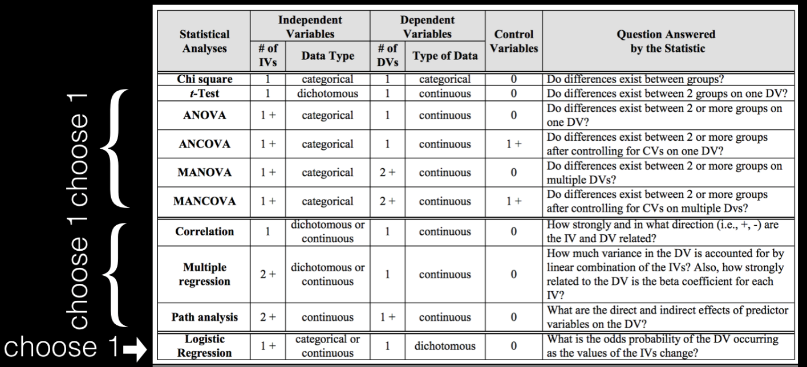

verifying Null hypothesis

a. verify that their Null and alternative hypotheses are formulated correctly

b. verify that the data supports the project: i.e. if the a data has the appropriate features (variables) to answer the question, and if the data was properly pre-processed to extract the needed values (there is some flexibility here since the test was not chosen yet)

c. chose an appropriate test to test H0 given the type of data, and the question asked. 

| **Statistical Analyses	|  IV(s)  |  IV type(s) |  DV(s)  |  DV type(s)  |  Control Var | Control Var type  | Question to be answered | _H0_ | alpha | link to paper **| 
|:----------:|:----------|:------------|:-------------|:-------------|:------------|:------------- |:------------------|:----:|:-------:|:-------|
Chi-Squared	| 1,  | Name & Religious Priming| 1, Rating of popular political figure| categorical | 1, Religion |Categorical) | Does Politically conservative participants primed with President Obama’s middle name rate him more negatively than would those who are not shown his middle name? | Middle Name Primed Rate Negatively >= Middle Name Not Shown | 0.05 | [The effects of name and religious priming on ratings of a well-known political figure, President Barack Obama]( http://journals.plos.org/plosone/article?id=10.1371/journal.pone.0180676) |
  |||||||||

| **Statistical Analyses	|  IV(s)  |  IV type(s) |  DV(s)  |  DV type(s)  |  Control Var | Control Var type  | Question to be answered | _H0_ | alpha | link to paper **| 
|:----------:|:----------|:------------|:-------------|:-------------|:------------|:------------- |:------------------|:----:|:-------:|:-------|
Correlation	| 1, electrophysiological Measurement| continuous | 1, behavioral Measurement | continuous | 2, Gender & Chronological Age | Dichotomous/Categorical | Is Behavioral auditory and language measurements and electrophysiological evaluations Correlated?  |Behaviorial Measurements depends on Electrophysical Measurement | 0.05 | [Cortical maturation in children with cochlear implants: Correlation between electrophysiological and behavioral measurement]( http://journals.plos.org/plosone/article?id=10.1371/journal.pone.0171177) |
  |||||||||

| **Statistical Analyses	|  IV(s)  |  IV type(s) |  DV(s)  |  DV type(s)  |  Control Var | Control Var type  | Question to be answered | _H0_ | alpha | link to paper **| 
|:----------:|:----------|:------------|:-------------|:-------------|:------------|:------------- |:------------------|:----:|:-------:|:-------|
Logistic Regression	| 1, Flow cytometry measurements| Continous | 1, Diagnosed Leukemia| categorical | - |- | Can Leukemia be predicted using Flow cytometry measurements | Test Scores ~= Mean Features| 0.05 | [Leukemia Prediction Using Sparse Logistic Regression]( http://journals.plos.org/plosone/article?id=10.1371/journal.pone.0072932) |
  |||||||||

